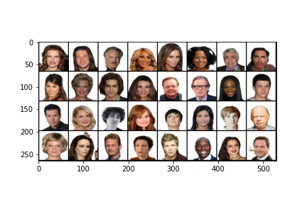
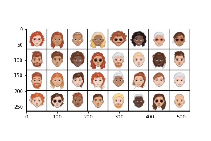

# Avatar Image Generator

   Faces Domain <br/>
   

   Generated Cartoons <br/>
   

   Based on the paper XGAN: https://arxiv.org/abs/1711.05139

## Dataset
  Cartoon dataset: we use the CartoonSet dataset from Google (https://google.github.io/cartoonset/), both the versions of 10000 and 100000 items.
  You can download from shell file, run `download-cartoon.sh`.

  Faces dataset: we use the CelebA dataset (https://mmlab.ie.cuhk.edu.hk/projects/CelebA.html)
  
  Also, you can use another face datasets such as 
  
  1) VggFace dataset (https://www.robots.ox.ac.uk/~vgg/data/vgg_face/) from the University of Oxford
  2) FFHQ dataset (https://github.com/NVlabs/ffhq-dataset) from NVIDIA.

  You can get sampled data from https://drive.google.com/file/d/1A9CRETxqugKr1ae7G1ICIqO8u7ST5_SP/view?usp=sharing,
  but recommend to use total dataset if you can.
## Directory structure

  `config.json`: contains the model configuration to train the model and deploy the app
  
  `weights`: contains weights that we saved the last time we train the model. 

```
├── app.py
├── avatar-image-generator-app
├── config.json
├── Dockerfile
├── images
│   ├── Cartoons_example.jpeg
│   └── Faces_example.jpeg
├── LICENSE
├── losses
│   └── __init__.py
├── models
│   ├── avatar_generator_model.py
│   ├── cdann.py
│   ├── decoder.py
│   ├── denoiser.py
│   ├── discriminator.py
│   ├── encoder.py
│   └── __init__.py
├── pytorch_fid
│   ├── fid_score.py
│   ├── inception.py
│   ├── __init__.py
│   ├── __main__.py
│   └── __pycache__
├── README.md
├── requirements.txt
├── scripts
│   ├── copyFiles.sh
│   ├── download-cartoon.sh
│   ├── download_faces.py
│   ├── keepFiles.sh
│   ├── plot_utils.py
│   └── preprocessing_cartoons_data.py
├── sweeps
│   ├── sweep-bs-1.yaml
│   └── sweep-rs-1.yaml
├── train.py
├── utils
│   └── __init__.py
└── weights
    ├── c_dann.pth
    ├── d1.pth
    ├── d2.pth
    ├── denoiser.pth
    ├── disc1.pth
    ├── d_shared.pth
    ├── e1.pth
    ├── e2.pth
    └── e_shared.pth
```
## The model
Our codebase is in Python3. We suggest creating a new virtual environment.
   * The required packages can be installed by running `pip3 install -r requirements.txt`
   * Update `N_CUDA` by running `export N_CUDA=<gpu_number>` if you want to specify the GPU to use 

   It is based on the XGAN paper omitting the Teacher Loss and adding an autoencoder in the end. The latter was trained to learn well only the representation of the cartoons as to "denoise" the spots and wrong colorisation from the face-to-cartoon outputs of the XGAN.

   The model was trained using the hyperparameters located in `config.json`. Weights & Biases Sweep was used to find the best hyperparameters:

1. Change `root_path` in `config.json`. It specifies where is `datasets` which contains the datasets. 
2. Run `wandb login` to use wandb to get the report
3. Run `python3 train.py --wandb --run_name <RUN_NAME>` or `python3 train.py --no-wandb`

  You can see the Weights & Biases report here: https://wandb.ai/choheeseung/avatar_image_generator
  
## Evaluation
Fréchet Inception Distance will be used for our task evaluation.

FID is a measure of similarity between two datasets of images. It was shown to correlate well with human judgement of visual quality and is most often used to evaluate the quality of samples of Generative Adversarial Networks. FID is calculated by computing the Fréchet distance between two Gaussians fitted to feature representations of the Inception network.

You can see the details in https://github.com/mseitzer/pytorch-fid.
